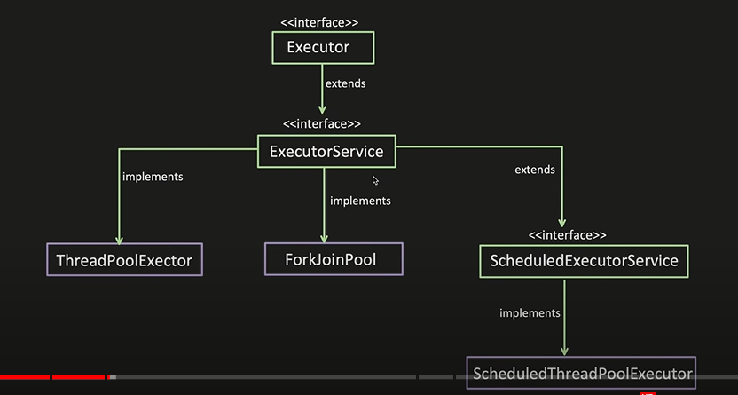

## ThreadPool
    alternative to creating a new thread per task to execute
    when you need to limit the number of threads running in your application at the same time
        Create a pool of threads, into which you can submit tasks to be executed.
        New tasks submitted to the pool are first stored internally in a queue.
        From the queue pool of threads will take the task and executes them
        Once thread executed the task it takes new task from the queue.
        If no new tasks to do, It will wait for the tasks to arrive
        If we mentioned keepAliveTime, after that time if we have more threads than min no. of 
            threads remaining threads will be removed from pool
        Submitted task does not depend on 1 particular thread to execute it. whichever thread is free takes and executes it
    What happens when submit a task?
        check if thread available? if yes assign the task to that thread
                                    if no, put the task to queue
        once any thread complete its task, come and check the queue and get the task if available
    Advantages - 
        Thread creation time can be saved
        managing thread lifecycle is removed
        increased performance- by having fixed no. of thread if pool size is less, less context switching, saves time

### Thread Pool implementation
    Thread Pool contains
        Custom Thread Pool implementation - CustomThreadPool.java
                BlockingQueue - To store the taks
                List<RunnableThread> - Based on what is the size of pool
                flag - to check whether pool is active or not
        Java Thread Pools - 
                BlockingQueue<**RunnableWorkQueue**> - To store tasks
                **minPoolSize**, **maxPoolSize**, **keepAliveTime**(when idle), 
                **ThreadFactory**(factory to create threads from), 
                **RejectionHandler**(what happens when queue is full)
    To execute a task the method ThreadPool.execute(Runnable r) is called with a Runnable implementation as parameter.
    The Runnable is enqueued in the blocking queue internally, waiting to be dequeued.
    The Runnable will be dequeued by an idle PoolThread and executed

    Have a separate Wrapper Class to wrap the task to be executed by Thread pool, since it should be Runnable
        Refer CustomThreadPool.java for AsyncTaskWrapper class
## Executor Framework
    contains many interfaces like,
        Executor - execute()
        ExecutorService - submit(**Runnable**), submit(**Callable**), shutdown(), 
        ScheduledExecutorService - schedule(), scheduleWithFixedDelay(), scheduleAtFixedRate()
    Implementation -
        ThreadPoolExecutor - 
        ForkJoinPool - 
        ScheduledThreadPoolExecutor - 
    Advantages of Executor Framework -
        separates task creation and execution
        create tasks that implement either runnable or callable and send them to executor
        Executor maintains a thread pool to improve performance
        Executor is responsible for executing tasks, and running them using thread from pool

### ExecutorService
    ExecutorService mechanism, asynchronous execution which is capable of executing tasks concurrently in the background
    ES is interface has many implementation
        newFixedThreadPool() - with params minPoolSize, maxPoolSize, keepAliveTime, BlockingQueue<**RunnableWorkQueue**>
            internally it uses new **ThreadPoolExecutor**(nThreads, nThreads,0L, TimeUnit.MILLISECONDS,new LinkedBlockingQueue<Runnable>());
        
### Executors
    Provides Factory and utility methods for Executor, ExecutorService, ScheduledExecutorService, ThreadFactory, and Callable 
    It provides methods that create and return,
         ExecutorServic
         ScheduledExecutorService
         "wrapped" ExecutorService
        ThreadFactory
        Callable out of others, can be used in execution methods requiring Callable.
    Static factory methods provided by Executors for creating ExecutorService
    1. FixedThreadPool - creates a thread pool executor with fixed no. of threads
        ExecutorService executor = Executors.newFixedThreadPool(5);
            Min & Max pool - same
            Queue size - unbounded queue
            Thread Alive when idle - Yes
            When to uses? When we have exact info of how many Async task is needed
            Disadv - not good when workload is heavy, limited concurrency
    2. CachedThreadPool - unbounded thread pool that automatically adjusts its size based on the workload
        ExecutorService executor = Executors.newCachedThreadPool();
            creates a thread pool and creates a new thread as needed 
            There is no queue, when new task comes new thread created
            Min & Max pool - 0, Integer.MAX_VALUE
            Queue size - blocking queue size 0
            Thread Alive when idle - 60 seconds
            When to uses? Good for handling burst of short lived tasks
            Disadv - Thread pool create so many threads leads to m/y consumption
    3. SingleThreadExecutor - single worker thread
        ExecutorService executor = Executors.newSingleThreadExecutor();
            Min & Max pool - 1
            Queue size - unblocking queue
            Thread Alive when idle - Yes
            When to uses? When need to process tasks sequentially
            Disadv - No concurrency at all
    4. WorkStealingPool Executor - 
        It creates a Fork-join pool executor
        No. of threads depend upon the available processors or we can speicy in the parameter
        To consume CPU more effectively

### Java built in implementation of ExecutorService
    1. ThreadPoolExecutor - 
        new **ThreadPoolExecutor**(nThreads, nThreads,0L, TimeUnit.MILLISECONDS,new LinkedBlockingQueue<Runnable>())
    2. ScheduledThreadPoolExecutor - 
        new ScheduledThreadPoolExecutor(corePoolSize, threadFactory);
    3. ForkJoinPool
#### BlockingQueue
    used to hold the tasks when the threads are busy.
    queue that blocks,
        when queue is full and you try to enque items
        when queue is empty and you try to deque items
    Thread try to deque from empty queue wait until some thread enque some items
    Bounded Queue(preferred, since we can control) - Queue with fixed capacity - ArrayBlockingQueue
    Unbounded Queue - Queue with no fixed capacity - LinkedBlockingQueue
#### Thread Factory
    Factory for creating new thread
    ThreadPoolExecutor use this to create new thread.\
    Provides us an interface to , 1. give custom thread name, priority, set Daemon thread flag
#### RejectionExecutionHandler
    Handler for tasks that can not be accepted by thread pool.
    Like logging logic, for debugging
        ThreadPoolExecutor.AbortPolicy - throws RejectedExecutionException
        ThreadPoolExecutor.CallerRunsPolicy - Executing rejected task in caller thread itself(thread which submit the task) 
        ThreadPoolExecutor.DiscardOldestPolicy - Silently discard, without exception
        ThreadPoolExecutor.DiscardPolicy - discard the old task, accomodate new task
## ThreadPoolExecutor
    helps to create customizable thread pool
    can customize min thread, max thread, keep alive time, type of queue, thread factory, rejection handler
    flow for max thred, 1. check if thread available NO 2. check if queue have empty space NO 
                        3. check max pool size if available thread lesser than max create new thread and submit the task
                        4. If max pool size reached, how to handle the task Rejection
    check thread -> check queue -> check max thread -> rejection handler
    why not create max threads instead of putting to queue?
        min threads are sufficient to handle max scenarios, max thread will be reached only for specific scenarios
    constructor - ThreadPoolExecutor(int corePoolSize, int maximumPoolSize, long keepAliveTime, TimeUnit unit, 
                    BlockingQueue<Runnable> workQueue, ThreadFactory threadFactory, RejectedExecutionHandler handler)

    Refer - ThreadPoolExample.java
            create custom thread factory, custom rejection handler
#### Lifecycle of ThreadPoolExecutor
    Running - pool is ready, can submit task using submit()
    Shutdown - do not accept new task, continue executing existing tasks. once tasks are done moved to terminated state. shutdown()
    Stop - force shutdown - do not accept new task, forcefully stops current tasks, forcefully shutdown moves to Terminated. shutdownNow()
    Terminated - End of life. isTerminated() to check 

## ScheduledThreadPoolExecutor
    when we want to schedule tasks to run repeatedly or to run after a given delay for some future time
    It creates a fixed-sized Thread Pool
        ScheduledThreadPoolExecutor threadPool = (ScheduledThreadPoolExecutor)Executors.newScheduledThreadPool(4);
        threadPool.schedule(task1, 2, TimeUnit.SECONDS);  // task will execute after 2 s
        threadPool.scheduleAtFixedRate(task1, 2, 8, TimeUnit.SECONDS); // first task after 2s and repeats periodically for every 8s 
    