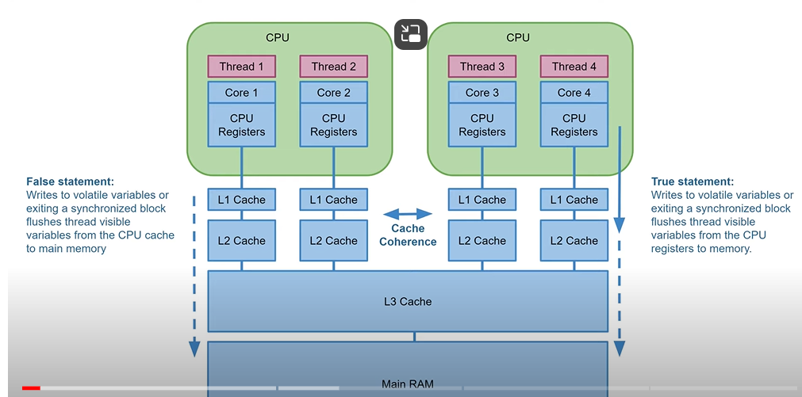

### Reentrance lock
    Reentrancy means that locks are acquired on a **per-thread rather than per-invocation** basis.
        If the thread have the lock, it can access any shared resource(which is monitored by same lock) authomatically. It won't end up in deadlock
        synchronized (lock) {
            doSomething(lock, ...)
        }
    i.e)acquiring lock for that same object by holding the same lock
    1. acquire lock 2. trying to acquire the same lock 3.have to release 2nd lock 4. release 1st lock
    
    Refer ReentranceLock.java
    It only works by same thread not between threads

## Limitation of Synchronized
    Only 1  thread can enter synchronized at a time
    no guarantee on which order thread get access(this leads to starvation for some threads) - we can use locks to overcome this
    performance overhead when enterimg and exiting sync blocks
#### visibility problem
    changes done by 1 thread stored at CPU cache not written back to main memory, thread 2 will use old value
### Volatile - being stored in main memory - to avoid visibility problem
    reduce performance since update happening in main m/y. Should be used when visibility of data between threads in necessary
    variable read/write happen directly in main memory not from CPU cache
    guarantees updates to a variable visible across threads
    Not only the volatile variable flushed to main memory, also other variables visible to that thread is also updated
        Instead of declaring each and every variable volatile, only one or a few need be declared volatile
        this.nonVolatileObj++;
        this.volatileObj++;
    when volatileObj value is updated to main memory, nonVolatileObj also updated to main memory
    same with read also, when reading volatile obj from main meory, other obj also updated from main memory
Note: Using volatile variable is not enough to achieve concurrency
#### Volatile race condition
    When multiple threads using volatile variable, there is a small gap in which data updated in CPU where the race condition occur.
        value++; involves 1. read the variable 2. increment the value 3. write the value back
        During this time race condition occur and inconsitent data happen
    To avoid this should use synchronized or atomic data types
### Cache Coherence - CPU's can share data between them through their caches no need to get it from main memory
    When Thread writes to volatile or exits synchronized block VM flushes thread visible variables from CPU registers to main memory.
    On the underground, values are flushed only to CPU cache, since it is available in cache it is visible to other CPUs and other thread can use
    Eventually this data will be flushed to main memory but not actively

## Thread Local
    To create variables that can only be read and written by the same thread
    even if multiple threads share a same ThreadLocal, each of them can set their own value without overwriting each other's values. 
    When getting, each thread will get the value set by it - not any value set by other threads.
    Each operation happen on ThreadLocal variable is local to that thread, copy is created for each
    ThreadLocalExample.java
Note: Be caution while using ThreadLocal in Thread Pool, since same thread might execute multiple tasks, same ThreadLocal value for multiple tasks\
TL values are unique to Threads not tasks

## Race conditions
    only happens when 2 or more threads **try to write to same variable** concurrently. 
        - both thread do count++ - can be fixed by synchronized block
        Visibility problem:
            - 1 thread write, 1 thread read - since we do not know when update write to m/y inconsistency happen here
            - 2 threads access same object, but not writing
            - 
    Thread access variable using
        check then act - map.containsKey("1") -> then remove, if 2 threads do this race condition occur-fix by synchronized(sharedMap),  
        Read modify write - count++; happen with multiple threads
## Concurrency vs Parallelism
    Concurrency
        - making progress on more than 1 task at the same time. In Single CPU
        - Use context switching to switch between threads and make progres
    Parallel Execution
        - making progress on more than 1 task exactly at the same time. Running in multiple CPU
    Parallel concurrent execution
        - 4 threads working with 2 CPU's
        - making progress on more than 1 task at exact same time with multiple CPUs
    Parallelism
        - Splitting single task to subtasks which can be executed in parallel
        - Big task divided into 4 tasks, can be run by 4 threads at the same time

    