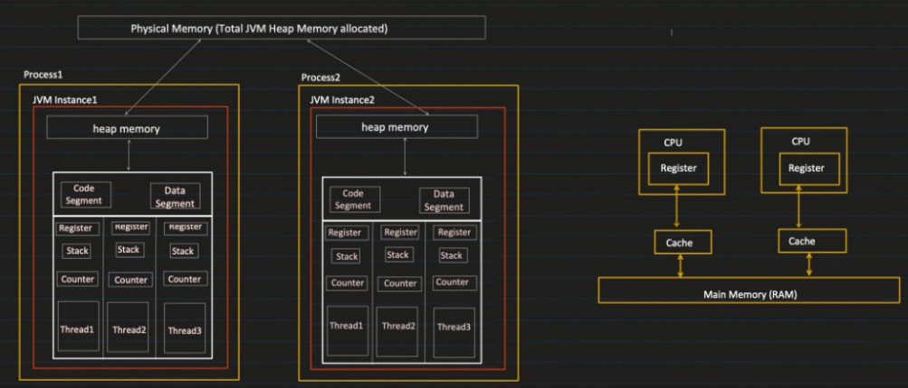
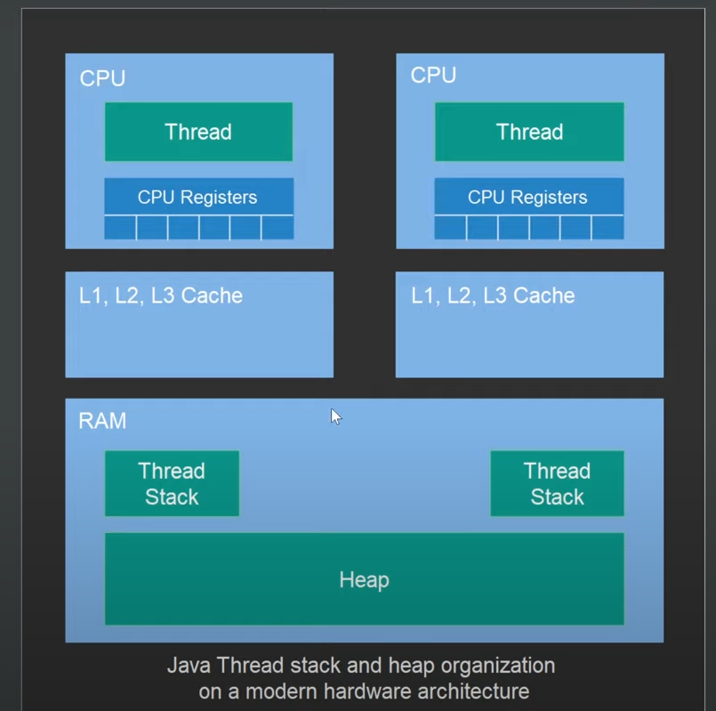
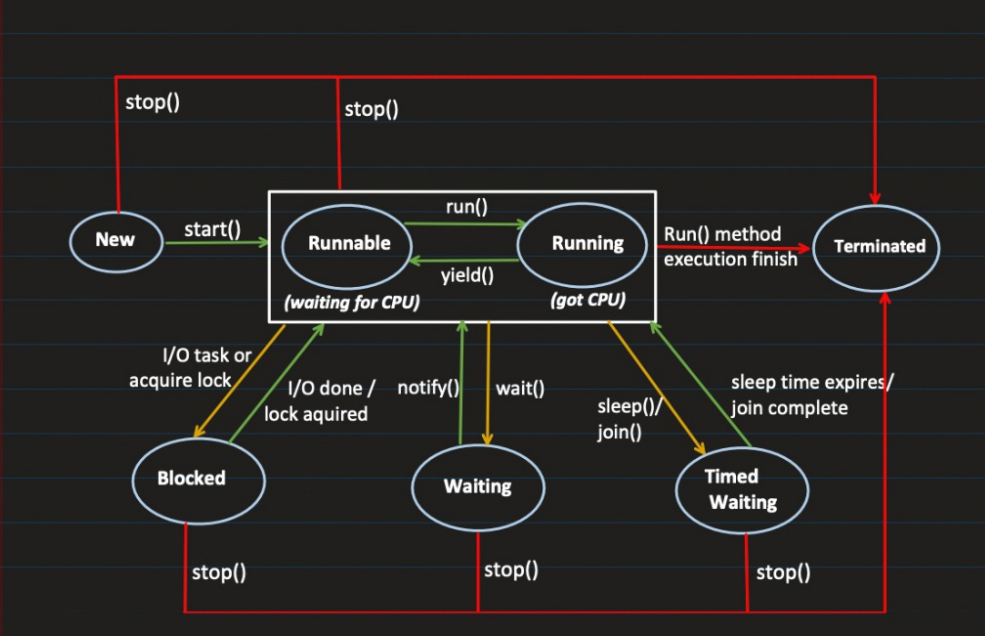

## Concurrency
    Ability to do more than one thing at a time
    Concurrency does not mean parallel execution in a single processor computer.
    When we have 1 processor obviosly it can do only 1 thing at a time but it can pause 1 task and do the next task for sometime.
    This process of switching between multiple task is called context switching.
    OS switches between multiple tasks and make progress for all tasks and looks like multiple things happening at a time.
    when we have 2 processor and 4 tasks, 2 tasks run parallel and switch to perform other 2 tasks.
    Concurrency does not mean parallelism. based on processor that many task can execute parallely, but n number of task can execute concurrently
    Multiprocessing - Multiple Processors/CPUs executing concurrently.
    Multitasking - Multiple tasks/processes running concurrently on a single CPU. The operating system executes these tasks by switching between them very frequently.
    Multithreading - Multiple parts of the same program running concurrently. In this case, we go a step further and divide the same program into multiple parts/threads and run those threads concurrently.

### Process

    process is a program in execution
    has its own address space, call stack, thread. os allocates these when created
    when running java code using java Test, new JVM instance get created and starts new process
    we can configure the heap memory needed by java -Xms256m - Xmx2g Test -Xms(initial heap size) -Xmx(max heap size) once this is reached OutOfMemory error will occur
    OS keeps track of all the tasks and execute them by switching between tasks
### Thread
    
    Lightweight process, path of execution within the process
    Every process has 1 thread called **main thread**, main thread can create additional thread within process
    Threads in same process share 
        heap memory - Objects created at runtime using new keyword, can read and modify, **synchronization required.**
        code segment - compiled bytecode of java program, it is read only. Set of instruction which has to be executed step by step
        data segment - contains Global and Static variables. Threads can read and modify, **synchronization required**
    Have its own - 
        Register - Temporary memory location used to store data and processing results from thread, to hold on to the data CPU is currently processing
        Stack - Own memory space for thread. It manages method calls and local variables
        Counter - Program counter, points to the instrcution(code segment) which is getting executed. Increments its counter after successful execution of instruction

#### Context switching
    
    switching of the CPU from one process/thread to another process/thread to execute
    1. suspending the current task and storing the CPU's state(context), saving the line of code executed in program counter for later use
    2. retrieving the context of the next process from memory and restoring it in the CPU's registers
    3. returning to the location indicated by the program counter (returning to the line of code at which the process was interrupted) in order to resume the process.

## Thread Memory Model

    Local variables, references to objects are stored in thread stack, which is never shared with another thread
    Global variables stored in heap will be shared
    Race condition - when 2 threads try to access shared variable, if val =1, T1 and T2 increments it sametime, value become 2 instead of 3 even after 2 increments , that is update missing
    Visibility changes - when thread update a value, we are not sure when CPU going to write back(flush) the value to Heap. So we might not get updated value. event if thread 1 update the main memory, T2 might read the value from its local private copy instead of main memory
    **Cache coherence** - When CPU 1 needs some data, value will be taken from CPU 2 cache instead of getting it from RAM. By doing that it have early access to the updates
    To avoid race condition and visibility problem we have to use volatile keyword or Synchronized block
        volatile(solution for visibility issue) - instead of updates happening in cache it make sure updates happen in main memory
            If we have multiple shared values thread use, if we declare 1 variable volatile when we write/read to that volatile variable all the other variables(non volatile) visible to that thread is also flushed/refreshed. no need to have volatile keyword on each
            while **Instrcution reordering happening in this scenario, visibility issue happens** since all the values are flushed only when volatile variable got flushed same with refresh too
        synchronized(solution for race condition) - make sure only one thread enter that block of code
    Data between threads can be shared only via Heap not with Thread Stack.

    **Instrcution reordering affects** the correctness of data when object is shared between threads
    While running thread takes the shared copy of the object and store in its memory

#### Instruction reordering

    To increase paralellism CPU tries to look ahead and find the instructions which is independent i.e) it can be run paralelly and reorder them 
        Ex. if we have 4 instructions. a=b+c, d=a+e and f=g+h, i=f+j. 1&2, 3&4 instructions are dependent can't be run paralelly but 1&3, 2&4 can be run paralelly.
            To help CPU, compiler(JIT)/Java VM reorders them    a=b+c, f=g+h and d=a+e, i=f+j. so that 1&2 can run paralelly then 3&4 to improve paralellism
#### volatile happens before guarantee

    while instruction reordering java guarantees 
           that any write to a variable happening before write to a volatile variable remains before volatile write. Compiler won't reorder the instruction to run after volatile write
            that any read happening after volatile read, remains after volatile read, it can't be reordered before volatile read
#### Synchronized visibility guarantee

    when thread enters the synchronized all the values that are visible to the thread gets refreshed from main memory
    when thread exits all the values visible to thread gets flushed back to main memory
#### synchronized happens before guarantee
    
    while instruction reordering java guarantees 
        any write happens before synchronized block happens before, it won't be reordered to happen after
        any read happens after synchronized blocks happen after, it won't be reorderd to happen before
    By having synchronized block JVM makes sure when it enters the block load the data from main memory, when it exits it flush the data to main memory
## Create Thread
    
    2 ways to create a thread
    1. extending thread class
    2. implementing runnable interface - if you are only planning to override the run() method and no other Thread methods
    Why 2 ways? class can extend only 1 method but can implement multiple interfaces
### Extending Thread
Thread class itself implements runnable interface with an empty implementation for run() method

    create class and extend it from Thread class
    override run() method - task which thread has to do
    create object of custom thread, call start. 
    main thread won't wait for custom thread execution to finish, Refer ExtendThread.java
    start() - creates new thread and calls run method of our custom thread
    run() - does not create new thread with main thread itself it executes the run method, purpose of thread concept itself not valid here
    Eg: If we print thread names by starting thread with start() o/p: main, Thread-0, with run() o/p: main, main

### Implements Runnable
We have Thread class itself which is already doing what we wanted, only because we cannot extend multiple classes we go for Runnable.\
Thread class have implemented all necessary methods, so we are using that class just by passing our runnable instance
It involves 2 steps, Create a runnable object. Start the thread(create instance of runnable object, pass object to Thread class constructor, start thread)
    
    create a class that imlements Runnable interface
    override run() method
    Create instance of new class
    pass the runnable object to Thread constructor
    start the thread
    
#### Best way to initiate thread

    Inheritance is meant for extending functionality of parent class, by extending Thread we are just providing implementation 
    of run nothing else. So it better to go with Runnable

## Thread Lifecycle - States

    NEW – a newly created thread that has not yet started the execution
    RUNNABLE – either running or ready for execution but it’s waiting for resource allocation
    RUNNING - when thread start executing its code
    BLOCKED(ML) – waiting to acquire a monitor lock to enter or re-enter a synchronized block/method from other thread
    WAITING(ML) – when we call wait()  method, makes in non runnable. goes back to runnable by calling notify() or notifyAll()
    TIMED_WAITING(N-ML) – waiting for some other thread to perform a specific action for a specified period then come back to runnable state
    TERMINATED – has completed its execution, cannot be started back again
ML - Release Monitor Lock, N-ML - Do not release monitor lock

#### Monitor Lock
    
    It helps to make sure only 1 thread goes inside the particular section of code(synchronized block or method)

## Java Thread Methods

    start() - initiates the execution of thread, calls run method thread class or runnable object. have to start the thread using start
    run() - contains the code that will be executed in thread, must be overridden
    getState() - provides current state of thread
    isAlive() - checks whether the thread is alive
    getName() - returns name of thread
    setName() - set custom name to thread
    getId() - get unique id of thread
    Thread Synchronization and Interruption
        join() - allows one thread to wait for the completion(die) of another eg. thread1.join(); main thread waits until thread1 completes its task
                If we want main thread to wait T1&T2, call T1.join();T2.join(), So main will wait for T1&T2 to complete execution
                helpful when we want to coordinate tasks, before moving ahead
        interrupt() -  interrupts the thread, causing it to throw an InterruptedException the next time it checks for interrupts.
        isInterrupted() - Checks whether the thread has been interrupted
    Thread Priority
        getPriority() - Returns the thread’s priority.
        setPriority(int priority) - Sets new priority to the thread.
    Daemon Threads - Threads which run on background. Daemon threads are automatically terminated when all user threads have completed.
        setDaemon(boolean on) - marks the thread as a daemon thread or a user thread. 
        isDaemon() - method checks whether the thread is a daemon thread.
        Can set the thread to daemon only befor starting, else IllegalThreadStateException occurs
        Alive till any 1 user thread is alive
        Running Asynchronously
        Garbage Collector, autosave in editor, Logging
    Sleeping and Waiting
        sleep(long millis[, long nanos]) - causes the currently executing thread to sleep for the specified number of ms
        wait() - causes the current thread to wait until another thread calls notify() or notifyAll() on the same object
        notify() - wakes up a single thread that is waiting on this object’s monitor
        notifyAll() - wakes up all threads that are waiting on this object’s monitor
    currentThread() - Returns a reference to the currently executing thread object
    yield() - causes the currently executing thread to pause and allow other threads to execute. hint to scheduler thread is ready give it resources voluntarily for other thread. output unpredictable
    activeCount() - Returns an active thread count of the current threads thread group and its subgroup.
    getThreadGroup() - Returns the current thread group this thread belongs to.
    
#### Why Thread.stop(), Thread.suspend(),Thread.resume() are deprecated
    Stop- Terminates abruptly, no lock release, no resource clean up
    Suspend - Put the thread on hold temporarily. No lock release
    Resume - Used to resume suspended thread
Both can lead to issues like deadlock. 

    If T1 has lock, T2 wait for the lock. T1 Stopped, T2 will keep on waiting
    If T1 has lock, T2 wait for lock. T1 suspended, T2 has to wait till T1 resume and release the lock
    

#### Thread Priority
    Just a hint to thrad scheduler, can't guarantee the order
    Thread with the highest priority will get an execution chance prior to other threads.
    If two threads have the same priority then we can’t expect which thread will execute first. It depends on the thread scheduler’s algorithm
    The default priority is set to 5 as excepted.
    Minimum priority is set to 1.
    Maximum priority is set to 10.
    main thread set with priority 5
    public static int NORM_PRIORITY(5), public static int MIN_PRIORITY(1), public static int MAX_PRIORITY(10)

#### Deadlock
    
    “Thread.currentThread().join()”, will tell Main thread to wait for this thread(i.e. wait for itself) to die. Thus Main thread wait for itself to die, which is nothing but a deadlock.
    
#### Monitor Lock
    helps to make sure only 1 thread goes inside particular section of code (synchronized block or method)
    Each object have monitor lock. only 1 thread can get the monitor lock at a time

## Synchronization 

    make sure by some synchronization mechanism that only one thread can access the resource at a given point in time. 
    Synchronization works on monitor locks on current object, by getting and releasing the monitor locks.
    synchronized method belongs to instance but synchronized(this) block belongs to object we mention in (), here it belongs to the current instance.
        Instance methods - one thread at a time can execute inside a synchronized instance method per instance
        Static methods - One thread per class regardless of which static synchronized method it calls
        sync blocks inside instance methods - Only one thread can execute inside a Java code block synchronized on the same monitor object.
        sync blocks inside static methods - Only one thread can execute inside a Java code block synchronized on same monitor class.
### Synchronize instance method - one thread per instance
A synchronized method attempt to **hold a lock on the instance** - means particular whole instance is not available for any other synchronized method call, but non synchronized method call can happen
Holding a lock means at a time only 1 thread can access the shared resource i.e)synchronized method/block

    Synchronized method and Synchronized(this) is same, since both acquire lock on current instance
#### On same instance

    Only one thread can execute inside a code block synchronized on the **same monitor object**. monitor is applied on the object on which the method is called
    Only 1 thread can execute any 1 synchronized method of that particular instance, another thread should wait
    Another thread with same shared instance should wait for existing synchronized call to complete and lock is released
    **Only synchronized methods are protected**. Another thread can call non synchronized method simultaneously with same instance. 
    Another thread can call any synchronized method with **another instance**
    Another calls(synchronized or non synchronized) to same instance in the same thread run synchronously, wait for each instruction to complete before executhing other
    Refer SynchronizedInstanceMethod class
        Scenario 1 - T1 sync method, T2 sync method - cannot happen parallel, since T1 got lock
        Scenario 2 - T1 sync method, T2 non sync method - can happen
        Scenario 3 - T1 sync method, T1 sync method - can happen synchronously        

#### On another instance

    Since it is locking another instance we can call synchronized method simultaneouly even if another thread is executing same method with another instance
    all other rules apply as working with same instance
        Scenario 4 - T1 sync method, T3 sync method with another instance, can happen parallel
### Synchronize static method - one thread per class
    Helps while object creation or properties configuration for whole class
    Since static keyword belongs to class, we have to have the lock at class level, object level lock is not enough. Since the shared static value belongs to all instances.
    Everything deals with class level, since it is static method we cannot create diff object and pass with diff threads
    One thread per class regardless of which static synchronized method it calls.
    Refer: SynchronizedStaticMethod class
        Scenario 5 - T1 sync static method, T3 sync static method with another instance, can't happen parallel. lock is on class not on object

Note: When we have both static method(lock on class) and non static method(lock on instance) in same class both can be called independently.\
Since both work on different lock it won't affect each other. Refer StaticVsNonStaticMethod.class
### Synchronized Block

    synchronized(instance of locked object/class to be locked) - 
            monitor object cannot be null
            String should not be used as monitor object, wrapper objects should not be used
    lock will be put on passed reference, so other methods or same methods on this class is accessible for other threads
    Only synchronized block is unavailable based on lock
    Limitation - 
        Only 1 thread can enter the block at a time
        No guarantee at which order thread get access to this block
#### Synchronized Blocks in Instance Methods - One thread per instance of locked object
    When we use any object as a shared resource like sending email, instead of putting lock on method, we can put a lock on sendEmail object.
    This is possible only using synchronized block, since we can specify the object we have to put a lock on
    Synchronized(this) or Synchronized(email) - lock will be put on instance or email object
        when putting lock on this object it works same synchronized method
        Scenario 1 - T1 Sync block, T2 Sync block - call simultaneously only lock object execute synchronously
        Scenario 2 - T1 Sync block, T2 normal method - happen parallel
        Scenario 3 - T1 sync block, T2 sync method. happen parallel since lock is on send email
        Scenario 4(Diff ins) - T1 sync block send, T3 sync block send **work parallel** since lock is on diff object
        Scenario 5(Diff ins, same monitor) - T1 sync block send, T4 sync block send **can't work parallel**, since the lock is shared
Note: Diff thread with Diff instance can call simultaneously since lock is on object
#### Synchronized Blocks in Static Methods - One thread per class of locked object
    When we use class as lock Scenario 4 won't happen parallel since lock is on class itself
        Scenario 1 - T1 Sync static block, T2 Sync static block - call simultaneously only lock object execute synchronously
        Scenario 2 - T1 Sync static block, T2 normal method - happen parallel
        Scenario 3 - T1 sync static block, T2 sync method. happen parallel since lock is on send email
        Scenario 4(Diff instance) - T1 sync static block send, T3 sync static block send can't work parallel since lock is on class
Note: Even Diff thread with Diff instance can't call simultaneously since lock is on class

### what happens with thread synchronization at JVM level
    
    1. Thread request JVM to enter synchronized block or method
    2. If lock is available thread acquires intrinsic lock of object or class
    3. thread executes sync method or block
    4. thread releases intrinsic lock for other threads

### Overall understanding on synchronization

    Thread try to call a method, 
        1. It checks whether it is synchronized, if not calls directly
        2. If synchronized, thread check with JVM for its lock
                if static method, check for class lock
                if instance method, check for object lock
                if block inside static method, check for locked objects lock is available. since we cannot use instance method inside static method we have to pass SendEmail.class only
                if block inside instance method, check for locked class lock is available
        3. If lock available, thread acquires lock and execute
        4. If one thread executes, lock won't be available for other thread hence it waits
        5. Once thread done execution, it releases the lock for other threads to acquire